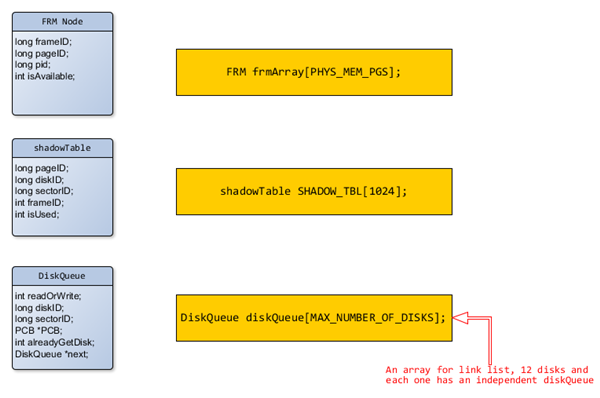

<h1 style="text-align:center;">Architectural Document </h1>
<section style="text-align:center; color:red"><b>Attention</b>: my program is finished in VS 2010 | 2013, so please compile & run it in <b>windows</b>. Thanks</section>
##a. Elements in your design
###1. Data Structure for Phase 2:   
<section style="text-align:center;">

</section>
###2. Custom Function for Phase 2 in base.c 
1. `void memory_printer()`   
This is a function I used to print current Memory status(current time, target pid, current action, running pid, ready/timer/suspend queue status ).     
2. `void disk_queue_print();`      
This function is used to print the detail for each disk queue. And it is called in `schedule_printer()`  
3. `void frameInit( void )`      
This function is used to initialize the 64 frames when the OS is starting.       
4. `void shadowTableInit( void );`      
This function is used to initialize the shadow table when the OS is starting.    
5. `void disk_readOrWrite(long diskID, long sectorID, char* buffer, int readOrWrite);`   
This function is used to do disk read and write. After each I/O operation starts, the current process will be added to its disk queue, and wait for I/O interrupt -- Asynchronized function.   

6. `void disk_readOrWrite_without_dispatch(long diskID, long sectorID, char* buffer, int readOrWrite);`    
This function is used to do disk read and write without dequeue or dequeue operaions -- Synchronized function[not used in my program].  
7. `int check_disk_status(long diskID);`  
This function is used to check whether the disk is in use or not, and return the status.  
8. `void append_currentPCB_to_diskQueue(long , long , char* , int);`    
This function is used to append current process to the **end** of one disk queue, which means current process cannot get the disk resource before coming.  
9. `void add_currentPCB_to_diskQueue_head(long , long , char* , int);`     
This function is used to append current process to the **head** of one disk queue, which means current process already got the disk resource.  
10. `void disk_node_transfer( INT32 diskID);`    
This function is used to check the disk queue, and dequeue the nodes who already finished their I/O operations, and one more node who hasn't got disk last time to ready queue. -- This function is called in `interrupt_handler()`.  

###3. High Level Design
**To make things easier, I will use images to demonstrate how my system calls work:**    

1. `SYSNUM_DISK_READ`    

2. `SYSNUM_DISK_WRITE`  

3. `interrupt_handler`    

4. `fault_handler`    
 

###4. Justification of High Level Design
In the user model(test.c), multiple system calls are called. So that in SVC (base.c) of kernel model, I define multiple routines to deal with different system calls.   

For example, when some function in test.c calls SLEEP, in base.c, startTimer() is invoked. It will add the current process to timerQueue, then calls dispatcher(), which will check whether readyQueue is empty or not, if readyQueue is not empty, then extracts the first node from readyQueue as current running process, then the program continues. Otherwise, it will call idle() until some process is actived from timerQueue and ready to use and then extracts the first process from the readyQueue, so that the program continues.

I also describe how other routines work above with images and details for each functions. I am trying to make my ideas as clear as possible, and wish I make it. By the way, you can also find more details in my code, as I have add tons of comments there.   

###5. Additional Features
1. I just implement case 1 in test1l, and I feel so shamed that I could implement the whole test1l

###6. Anomalies and bugs
My program will throw "***Fault_handler: Found vector type 4 with value 0***" error in following two cases:    
	1. the `schedule_printer()` is called in some locations which seems not appropriate  
	2. in test1l case 2, I stuck on this issue

Source Code
========

     a) base.c -- Almost all my logic issues are handled here
     b) custom.h -- I define my own data structure here, also some macros are defined here

Test Format
=======
     I have added schedule_printer() & memory_printer() in my code.

Test Results
======
	a) Test program 2a runs and gives expected output.
	b) Test program 2b runs and gives expected output.
    c) Test program 2c runs and gives expected output.
    d) Test program 2d runs and gives expected output.
    e) Test program 2e runs and gives expected output.
    f) Test program 2f runs and gives expected output.
	g) Test program 2g runs and gives expected output.
    l) New feature-- Test program 1l runs, but only case 1 gives expected output (case 2, 3 fail).
	m) New feature-- Test program 1k runs and gives expected output.
