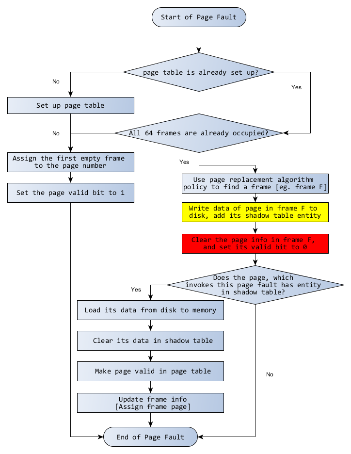
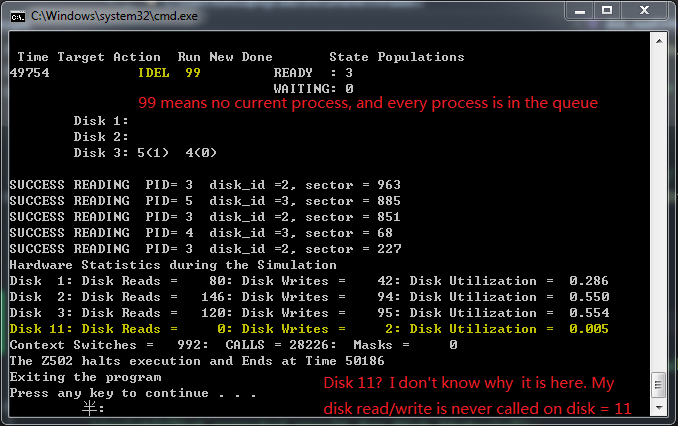

<h1 style="text-align:center;">Architectural Document </h1>
<section style="text-align:center; color:red">
<b>Attention</b>: my program is finished in VS 2010 | 2013, so please compile & run it in <b>windows</b>. Thanks -- Hao Zhou | hzhou@wpi.edu
</section>
##a. Elements in your design
###1. Data Structure for Phase 2:   
<section style="text-align:center;">

</section>
###2. Custom Function for Phase 2 in base.c 
1. `void memory_printer()`   
This is a function I used to print current Memory status(current time, target pid, current action, running pid, ready/timer/suspend queue status ).     
2. `void disk_queue_print();`      
This function is used to print the detail for each disk queue. And it is called in `schedule_printer()`  
3. `void frameInit( void )`      
This function is used to initialize the 64 frames when the OS is starting.       
4. `void shadowTableInit( void );`      
This function is used to initialize the shadow table when the OS is starting.    
5. `void disk_readOrWrite(long diskID, long sectorID, char* buffer, int readOrWrite);`   
This function is used to do disk read and write. After each I/O operation starts, the current process will be added to its disk queue, and wait for I/O interrupt -- Asynchronized function.   

6. `void disk_readOrWrite_without_dispatch(long diskID, long sectorID, char* buffer, int readOrWrite);`    
This function is used to do disk read and write without dequeue or dequeue operaions -- Synchronized function[not used in my program].  
7. `int check_disk_status(long diskID);`  
This function is used to check whether the disk is in use or not, and return the status.  
8. `void append_currentPCB_to_diskQueue(long , long , char* , int);`    
This function is used to append current process to the **end** of one disk queue, which means current process cannot get the disk resource before coming.  
9. `void add_currentPCB_to_diskQueue_head(long , long , char* , int);`     
This function is used to append current process to the **head** of one disk queue, which means current process already got the disk resource.  
10. `void disk_node_transfer( INT32 diskID);`    
This function is used to check the disk queue, and dequeue the nodes who already finished their I/O operations, and one more node who hasn't got disk last time to ready queue. -- This function is called in `interrupt_handler()`.  

###3. High Level Design
**To make things easier, I will use images to demonstrate how my system calls work:**    

1. **`SYSNUM_DISK_READ`**     
    
2. **`SYSNUM_DISK_WRITE`**     
**Disk Write** almost shares the same flow chart with disk read, as disk READ/WRITE operations are wrapped in one function `void disk_readOrWrite(long diskID, long sectorID, char* buffer, int readOrWrite)`.     
  
3. **`interrupt_handler`**  
In phase 2, the `interrupt_handler()` should both deals with timer interrupt & **I/O interrupt**[I have introduced timer interrupt in phase 1, so I just give explanation for I/O interrupt here].     
  
4. **`fault_handler`**    
**fault_handler** is very important in phase 2, as I find that except for test2c and test2d, all other test case rely on it for implementation.     
In my program, I tried three page replacement algorithms of **Second-Chance**, **FIFO**, and one other **weird way** -- use only one frame to do all the replacement.

###4. Justification of High Level Design
In phase 2, I add two more system call `SYSNUM_DISK_READ` and `SYSNUM_DISK_WRITE`, and I have discribed their Workflow above.    

Below, I will show how page tabke, frame table and shadow table interacts with each other[All of them are **array** format].   

1. Each process has an independent page table with size 1024 -- It is maintained by OS502, but it is a hardware-defined entity, while the hardware can only read it.            
2. Frame table with size 64 is shared by all processes -- Frame struct is defined by me, but I recognize it as a map for MEMORY array defined by haedware.    
3. Each process has an independent shadow table with size 1024, which store  the disk location for the page that is replaced.    
4. **Page table** will be initialized when the first page fault happens in `fault_handler()`, while frame table and shadow table are initialized when OS502 is starting.     
 

----------

----------

I am trying to make my ideas as clear as possible, and wish I make it. By the way, you can also find more details in my code, as I have add tons of comments there. Also, you can contact me by hzhou@wpi.edu for more infomation.       

###5.Comparison with different page replacement algorithms [  UNIQUE about my project]
I have tried three(maybe I can say 4) page replacement algorithms: **FIFO**, **Second Chance** and **Using fixed frame to do page replacement**.      
      
      
      
1. Surprising, that in **test2e** only one fix frame to do page replacement has a better profermance than other two in Page Fault count, Total execution time, and Read/Write disk times. I think that it happens because the page number of data to read/write is sequential(not ramdon), therefore this issue will not happen in test2f.      
2. FIFO & Second Chance have almost the same perfermance for test2e, because after the first round(set referrence bit to 0), second chance is the same as FIFO. Therefore, second chance costs 50 more execution time from above images.       
3. Below is an image of comparison for different algorithms. And we can find that "fixed frame" almost has the same performance with Second Chance. FIFO has the worst performance.      
           

###6. Anomalies    
1. Actually I understand how lock works, but I cannot use it well, which makes my program vulnerable. With or without schedule printer will bring very different result at the end, especially for multi-processes tests.      
2. For some issues, I believe I have very solid logic, but when I implemented for my program, it failed. Seems that there is a naughty "ghost" in this OS, who likes bringing troubles for me.  -- Good news, I can find another way or do a bit sacrifice for implementing that function [except for test2g :(  ].          
3. For test2d, only disk 1, 2 and 3 are used, but in the output I find that I have some disk operation on disk 11( Why 11? Actually, 11 is the largest disk index I checked in interrupt hanlder. 11 is changed with that).    

###7. Appendix:    
1. I changed the rules for **Limited** of Output Format, and it is no long the first 10 occurrences of the printout, but print the result every pre-determined numbers of calling for printer function. Eg. if I set `enableFaultPrint = 10`, it means that my program will print fault information every 10 times(10 fault events with just one fault print) when I call the print statement.       

Source Code
========

     a) base.c -- Almost all my logic issues are handled here
     b) custom.h -- I define my own data structure here, also some macros are defined here

Test Format
=======
     I have added schedule_printer() & memory_printer() in my code.

I have provided screenshots for each test at the end of this document! 

Test Results
======
	a) Test program 2a runs and gives expected output.
	b) Test program 2b runs and gives expected output.
    c) Test program 2c runs and gives expected output.
    d) Test program 2d runs and in most case it gives reasonable output.
    e) Test program 2e runs and gives expected output.
    f) Test program 2f runs and gives expected output.
	g) Test program 2g runs but cannot terminate correctly, and gives part reasonable output at first.   

Screenshots
=====
 
 
 
 
 
 
 